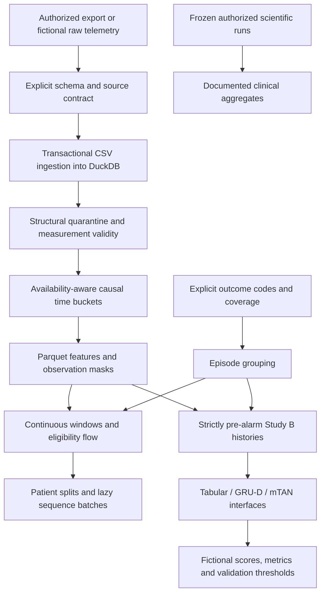

# From raw telemetry to research datasets and results

The data-processing pipeline is a first-class part of AI-CVD. The public repository
contains the maintained processing algorithms, a source-neutral ingestion adapter,
analytical storage, dataset construction, model-input preparation and evaluation
example. Source code is retained; generated clinical or intermediate artifacts are not.

The runnable public interface is `python -m ai_cvd.pipeline`. It processes local batch
exports. It is not a live device gateway, an electronic health record integration or
a clinically validated monitoring service.



## Run the complete process

Install using the [tested environment instructions](REPRODUCIBILITY.md), then:

```shell
python -m ai_cvd.pipeline demo --subjects 12 --seed 17 --output outputs/pipeline
python -m ai_cvd.pipeline verify outputs/pipeline/processed
```

This starts with generated **raw CSV records**, not preconstructed model arrays.
Fictional data include absent transmissions, repeated readings, implausible values,
inverted blood-pressure pairs, off-body flags, delayed delivery and step-counter resets.
The final model inputs come from the resulting processed Parquet features.

All outputs remain ignored:

```text
outputs/pipeline/
  raw/          telemetry.csv, coverage.csv, events.csv, source.json
  processed/    telemetry.duckdb, patients/*.parquet, patients/*.npz
                patients.json, episodes.json, quality.json, cohort_flow.json
                performance.json, run.json
  evaluation/   fictional scores, metrics and validation-selected thresholds
```

Neural parameters are untrained fixtures; the small logistic model is fitted only
on fictional subjects. This command does not regenerate the published or frozen
clinical results.

## Processing stages and code

| Stage | Implementation | Contract and output |
| --- | --- | --- |
| Ingest | [storage.py](../src/ai_cvd/pipeline/storage.py) | Exact canonical CSV header, explicit types/units, file digest, transaction and replay detection |
| Validate source | [features.py](../src/ai_cvd/pipeline/features.py) | Attested step semantics, availability, coverage and history policy |
| Quarantine structural faults | [storage.py](../src/ai_cvd/pipeline/storage.py) | Reject unknown units/types/status, naive or invalid timestamps and impossible availability ordering; count reason codes |
| Filter measurements | [features.py](../src/ai_cvd/pipeline/features.py) | Invalid values become missing; paired BP validity; duplicate handling; device-flagged values are unavailable |
| Align and derive features | [features.py](../src/ai_cvd/pipeline/features.py), [vector.py](../src/ai_cvd/pipeline/vector.py) | Closed five-minute buckets, masks, recency, rolling summaries and counter-reset rules |
| Construct episodes | [episodes.py](../src/ai_cvd/pipeline/episodes.py) | Adjacent-gap grouping using explicit recorded-outcome codes, without clinical notes |
| Filter eligible windows | [dataset.py](../src/ai_cvd/pipeline/dataset.py), [index.py](../src/ai_cvd/pipeline/index.py) | Run-in density, history and follow-up coverage; reconciled cohort flow; stable sample IDs |
| Store and materialize | [runner.py](../src/ai_cvd/pipeline/runner.py) | DuckDB ingestion store, compressed Parquet features, compact window indices and lazy sequence batches |
| Build Study B inputs | [study_b.py](../src/ai_cvd/pipeline/study_b.py) | Verified eight-day coverage, prior baseline, 24-hour pre-alarm history and existing feature/temporal adapters |
| Evaluate fictional methods | [demo.py](../src/ai_cvd/demo.py) | Training-only preprocessing, subject-isolated validation/test, metrics and whole-tie threshold selection |
| Verify and resume | [runner.py](../src/ai_cvd/pipeline/runner.py) | Input/task/implementation bindings, completion marker and checksums for every generated artifact |

The canonical feature builder, dataset routines, vectorized feature equations and
compact window-index algorithm are release copies of the repaired research pipeline.
They were not replaced by a new toy feature generator. The CSV/DuckDB orchestration,
numeric-outcome adapter and public example configuration are release interfaces.
Their identities do not replace frozen scientific provenance.

## Time, missingness and filtering

- Acquisition time and availability time are distinct. The reference path excludes
  readings received at or after their bucket closes, rather than backfilling them.
- Invalid observations remain missing. They are not clipped into plausible extremes.
- Pulse pressure is derived from valid paired readings before duplicate aggregation.
  Independently averaged SBP and DBP must not manufacture a valid pair.
- Conflicting step values at the same timestamp follow an explicit reject/exclude
  policy. A first cumulative reading or reset represents unknown activity, not zero.
- Continuous prediction uses `[t - 8 hours, t)` and targets `(t, t + 4 hours]`.
  Its buckets may close at prediction time. Study B instead requires bucket closure
  strictly before the alarm anchor. These are different interfaces and tasks.
- Subject split assignment does not depend on labels. Candidate eligibility does
  not depend on future event occurrence; label attachment and retrospective
  unsupervised-training selection happen separately.
- Coverage declarations are required. No observed row is treated as proof of complete
  outcome follow-up. Incomplete follow-up is censored, not labeled negative.

The example bounds and density thresholds in
[example.toml](../src/ai_cvd/pipeline/example.toml) are explicit engineering settings,
not diagnostic limits or a new clinical experiment specification.

## Reliability and performance

Each source file is loaded in a transaction. Replaying identical content is a no-op;
reused record identities in different file contents fail rather than silently replace
prior data. Malformed records remain quarantined with reason codes in the local store.

The pipeline uses a single writer, configurable DuckDB threads and a memory budget.
It processes subjects one at a time and stores feature grids once, with compact
window indices instead of duplicated overlapping sequence files. The lazy batch
reader verifies the run before materializing training inputs.

```shell
python -m ai_cvd.pipeline run --inputs outputs/pipeline/raw --output outputs/reprocessed
python -m ai_cvd.pipeline run --inputs outputs/pipeline/raw --output outputs/reprocessed --resume
python -m ai_cvd.pipeline benchmark --subjects 2 4 --days 2 --repeats 2 --output outputs/benchmark
```

Resume requires unchanged source digests, task, processing implementation and engine.
A completed run is verified and reused. An interrupted run reuses committed ingestion
and recomputes downstream outputs; it is not a per-patient incremental cache. A process
crash can leave an exclusive writer lock; inspect the process/run before removing a
stale lock. Checksum validation detects accidental changes, not a malicious actor who
can also rewrite the manifest.

The benchmark compares the retained reference and vectorized paths using the same
fictional immediate-availability inputs. The vector path explicitly rejects delayed
availability and non-excluded clinical-history contracts. Reports record stage time,
input throughput, row counts, software/platform and engine settings. They do not
claim clinical performance or population-scale throughput from a small fixture.

Memory is still bounded by the largest subject's history and its feature frame.
DuckDB's memory budget is not a measured process-wide peak. Live stream delivery,
distributed execution, source-specific firmware artifact detection and database
concurrency beyond the single writer are not implemented by this public adapter.

See [source contracts](architecture/source-contract.md),
[historical stage mapping](architecture/pipeline-history.md) and the
[thesis guide](THESIS.md).
