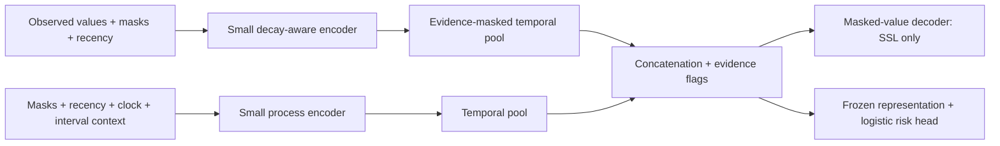

# Architecture selection for sparse retrospective alarm prediction

Decision memo, 26 September 2026. **Literature-informed recommendation, not an
experimental winner.** No model was trained for this review. No held-out test
scores, patient records, embeddings or checkpoints were inspected for selection.
The sparsity and limited-label constraints below were supplied in the study brief.
Detailed cohort statistics and source provenance remain in the private integrity
reports; this document does not release them.

## 1. Decision

**Do not finalize the historical CCA-TAVAE as the primary architecture.** Start
with a small, deterministic, missingness-aware masked temporal encoder, followed
by a frozen-encoder, regularized logistic risk head. Use two explicit input
branches, but start with concatenation rather than cross-attention:

- a value encoder with GRU-D-style decay and explicit observation masks;
- a smaller observation-process encoder for masks, recency and clock context;
- temporal pooling, concatenated representations and a small supervised head;
- a training-only masked-value decoder, discarded for risk inference.

Use the descriptive working name **observation-aware masked temporal encoder**.
This is a specification, not a claim to have invented a new model family or a
globally unique acronym. A single-encoder GRU-D baseline is the fallback if the
second branch fails to add reproducible value. Cross-attention is a bounded
ablation. A variational bottleneck is another ablation, not a requirement.

This combines candidates B and C below. The reason is the data: abundant unlabeled
histories support representation learning, whereas only 124 eligible training
Level-3 episodes support the outcome head. Hundreds of overlapping warnings per
small set of patients do not turn this into a large labeled training problem.
Reconstructing physiology and predicting a future button-press emergency proxy
are different tasks; a small supervised head explicitly bridges that mismatch.

**Blunt assessment:** CCA-TAVAE is not inherently an impossible architecture, but
its current clinical-conditioning story is unsupported by the primary inputs,
and its historical implementation is not a canonical missingness-aware VAE.
Adding cross-attention and KL regularization cannot recover unobserved physiology
or compensate for a poorly aligned outcome. A credible JBHI paper needs a useful,
tested scientific result; retaining a complicated name is not such a result.

## 2. Frozen task and repository evidence

The authority remains [the task configuration](../configs/tasks/level3_4h.toml),
with the [study protocol](study_protocol.md) and
[feature dictionary](FEATURE_DICTIONARY.md). This memo changes neither the
canonical dataset nor the endpoint, eligibility, split, normalization or sampling
artifacts. Future model input projections and training selections must be explicit
in a separate experiment configuration that references that task identifier.

| Constraint | Consequence for architecture selection |
|---|---|
| Five-minute grid, 96 steps, eight-hour history; four-hour outcome horizon | A short sequence does not require a large Transformer. Preserve `[t-8h,t)` inputs and `(t,t+4h]` targets. |
| Approximately 80–91% missing cells in core modalities | Numerical zero filling is only a tensor placeholder. Masks, recency and masked losses are necessary. Dense reconstruction loss rewards learning placeholders. |
| Some windows contain no directly observed physiology | No method has patient-specific physiological reconstruction evidence in such a window. Define an observation-only fallback and an evidence flag; never silently label it normal or remove it from evaluation. |
| Only 124 eligible training Level-3 episodes | Use episode/patient-aware supervision, small heads and patient-level resampling. The number of positive windows exaggerates independent information. |
| Very large event-free/unlabeled population | Sample training exposure efficiently; do not iterate all overlapping windows just because they exist. Keep full natural-prevalence evaluation unchanged. |
| Retrospective Level-3 classification attached to alarm initiation | Learn risk of the recorded-alarm endpoint, not generic physiological abnormality, ambulance dispatch, death or cardiovascular disease. |
| Undated clinical history excluded | Remove clinical-history conditioning from the proposed primary model. Unknown history must not be recoded as healthy history. |
| Researcher-attested capture/availability and retrospective support boundaries | These remain study limitations. A better encoder cannot validate source completeness or eliminate cessation-related selection bias. |

The inspected code establishes concrete migration requirements:

- [LSTM_VAE](../src/components/lstm_vae_model.py) uses a standard LSTM, Gaussian
  latent and LSTM decoder. Its encoder does not implement a GRU-D-style decay or
  receive a separate mask/recency contract.
- [The retired VAE trainer](../src/pipelines/02_train_vae.py) fills missing values
  with training means and applies dense MSE to the filled targets. That is not
  observed-only reconstruction. Its legacy execution guard must remain in place.
- [ClinicalCrossAttentionBridge](../src/models/supervised_sequence_net.py) makes
  a query from static features. With all static inputs unknown, a filled constant
  query can only become generic attention pooling, not patient-specific clinical
  conditioning. Feeding the actual NaNs is not valid either.
- `TimeAwareAttentionPool` in that file scores hidden states but takes no explicit
  time intervals. The name alone does not establish time awareness. The associated
  classifier reuses an LSTM encoder; its forward pass has no variational posterior
  or decoder. Calling the classifier a VAE would misdescribe its computation.
- [CGTANet](../src/models/cgta_net.py) also requires static inputs and has a
  different circadian-gated design. It is historical code, not a ready canonical
  comparator. No old checkpoint or old performance estimate is evidence here.
- [Indexed loading](indexed_loading.md) and
  [the canonical loader](../src/ai_cvd/compact.py) preserve IDs, order and train-only
  normalization. Future models must adapt to that interface, not resurrect old
  arrays or silently infer input columns.

## 3. Focused literature review

Search window: 25–26 September 2026. This is a focused review, not a systematic review
or proof of absence of prior art. Searches covered irregular clinical time series,
informative missingness, masked pretraining, low-label adaptation, temporal VAEs,
anomaly scoring, and value/mask cross-attention. Primary papers, proceedings,
publisher records and author manuscripts were preferred. Recent biomedical work
was checked alongside foundational methods. Evidence from ICU or laboratory
prediction is not direct evidence of effectiveness in elderly home monitoring.

Each row separates what the source establishes from this memo's applicability
judgment. No published benchmark number is transplanted to this dataset.

| Work and evidence status | Relevant contribution | Implication here |
|---|---|---|
| [GRU-D — Che et al., Scientific Reports, 2018](https://doi.org/10.1038/s41598-018-24271-9) | Explicit missingness masks and elapsed-time-dependent decay for clinical multivariate sequences. | Strong, economical baseline. Informative missingness is already established; it is not new merely because our application is remote monitoring. Decay toward a learned/default state is an assumption, not recovered measurement evidence. |
| [DATA-GRU — Tan et al., AAAI, 2020](https://ojs.aaai.org/index.php/AAAI/article/view/5440) | Time-aware recurrence with attention to reliability and clinical information. | Time awareness plus attention to data quality is established. Its medical-knowledge component cannot justify using unavailable histories in our primary experiment. |
| [MIAM — Lee et al., IEEE JBHI, 2022](https://doi.org/10.1109/JBHI.2022.3172549), [published abstract](https://pubmed.ncbi.nlm.nih.gov/35511839/), [author manuscript](https://arxiv.org/abs/2101.09986) | Attention-based integration of observed values, missing indicators and observation intervals; a training-time imputation decoder supports prediction. | The closest established JBHI precedent. Explicit value/mask/time fusion and an auxiliary decoder are not sufficient novelty claims. A MIAM-style fusion comparator is required if fusion is the paper's claimed advance. |
| [mTAN — Shukla and Marlin, ICLR, 2021](https://arxiv.org/abs/2101.10318) | Continuous-time embeddings and attention map irregular observations to fixed representations for interpolation/classification. | Attention over irregular time is established. Our frozen buckets have already discarded sub-bucket detail, so an adapter must not pretend it receives original raw timestamps. |
| [HeTVAE — Shukla and Marlin, ICLR, 2022](https://arxiv.org/abs/2107.11350) | Sparsity-aware temporal variational interpolation with heteroscedastic outputs and deterministic/probabilistic paths. | A relevant probabilistic comparator if uncertainty is claimed. Good interpolation uncertainty is not automatically calibrated Level-3 risk or useful anomaly ranking. |
| [Latent ODEs — Rubanova et al., NeurIPS, 2019](https://proceedings.neurips.cc/paper/2019/file/42a6845a557bef704ad8ac9cb4461d43-Paper.pdf) | Continuous latent dynamics, with an optional observation-time point-process likelihood. | Modeling the observation process alongside values predates this proposal. Continuous evolution does not supply evidence during long unobserved periods. |
| [Online Neural CDEs — Morrill et al., 2021 author preprint](https://arxiv.org/abs/2106.11028) | Addresses noncausal interpolation in online CDE prediction and evaluates continuous monitoring tasks. | A credible conceptual alternative, but interpolation must respect the prediction prefix. Solver overhead and already-bucketed inputs make it a lower-priority experiment here. The cited item is a preprint; this memo does not assert a reviewed venue for it. |
| [STraTS — Tipirneni and Reddy, ACM TKDD, 2022](https://doi.org/10.1145/3516367), [author manuscript](https://arxiv.org/abs/2107.14293) | Clinical observation triplets, continuous embeddings, Transformer encoding and forecasting-based self-supervision with limited-label evaluation. | The selected modern irregular-time comparator. It directly challenges any claim that sparse-clinical SSL plus a small outcome head is itself new. Clinical datasets and labels differ from ours. |
| [SAITS — Du et al., Expert Systems with Applications, 2023](https://doi.org/10.1016/j.eswa.2023.119619) | Self-attention-based imputation using reconstruction/imputation training and missingness-aware combination. | Useful masking/imputation precedent. Artificially held-out observed values do not identify naturally missing-not-at-random values. A diagonal attention mask is not a causal triangular mask. |
| [Ti-MAE — Li et al., 2023 author preprint](https://arxiv.org/abs/2301.08871) | Masked time-series representation learning by reconstruction. | Supports the deterministic masked-autoencoder family, not the claim that extreme clinical missingness has been solved. Do not inherit a dense-data masking ratio uncritically. |
| [PatchTST — Nie et al., ICLR, 2023](https://arxiv.org/abs/2211.14730) | Patching, channel-independent encoding and masked representation transfer for forecasting. | Patches can reduce computation, but coarse patches risk merging isolated readings. Generic forecasting transfer is not proof of few-shot clinical-event discrimination. |
| [TS2Vec — Yue et al., AAAI, 2022](https://arxiv.org/abs/2106.10466) | Hierarchical contrastive time-series representations used in downstream tasks. | A useful learning-strategy precedent. Here, contrastive views might identify acquisition schedules or patients; cropping can remove the only measurement. It is not another required search family. |
| [LIFE — Communications Medicine, 2025](https://www.nature.com/articles/s43856-025-00973-w) | Attention-based self-supervised laboratory-value imputation from EHR context. | Recent biomedical masked-learning precedent. Full-record imputation context and clinical-history availability cannot be assumed for online remote-monitoring prediction. Only indexed publisher abstract/method excerpts were accessible in this review. |
| [VIMTS — Hu et al., ICML, 2025](https://proceedings.mlr.press/v267/hu25y.html) | Visual masked-autoencoder adaptation for irregular multivariate forecasting, including few-shot evaluation. | Recent irregular-time masked pretraining and low-label capability already exist. Importing a visual foundation model adds complexity and a domain mismatch; forecasting results do not establish alarm prediction utility. |
| [TAMF — Luo et al., Information Fusion, 2026](https://doi.org/10.1016/j.inffus.2025.103866), [publisher description](https://www.sciencedirect.com/science/article/abs/pii/S1566253525009285) | Mask-guided temporal encoding, time-aware cross-source attention, contrastive fusion and reconstruction tasks in EMRs. | Close combination-level prior art. Its heterogeneous sources differ from value and observation views of one monitoring stream, but that distinction alone is a weak innovation argument. |
| [MUSE-Net — Wang, Liu and Yao, IEEE TASE, 2026](https://doi.org/10.1109/TASE.2026.3672337), [author manuscript](https://pmc.ncbi.nlm.nih.gov/articles/PMC13042865/) | Describes Gaussian-process imputation, time-aware attention, masks and multiple branches for longitudinal EHRs. | Another recent missingness/branching precedent. Its branches must not be casually equated to our proposed value/process split. Assessment here is limited to indexed primary-source abstract, architecture and conclusion excerpts; direct PMC access was challenged. |
| [FEMALA — “Fairness-Aware EHR Analysis via Structured Missing Pattern Modeling and Adversarial Low-Rank Adaptation,” manuscript labeled under review at ICLR 2026](https://openreview.net/pdf?id=oN7szRflpe) | The indexed methods excerpt describes temporal and structured-missingness encoders, bidirectional cross-attention between their embeddings, then adaptation. | Very close to the proposed two-branch fusion. Indexed Section 3/Eq. 5 supports that architectural overlap. The forum/PDF open was challenged, and acceptance/version history was not verified: cite as an under-review manuscript, not an accepted ICLR result. It motivates further checking, not a claim that every detail is identical. |
| [OmniAnomaly — Su et al., KDD, 2019](https://www.kdd.org/kdd2019/accepted-papers/view/robust-anomaly-detection-for-multivariate-time-series-through-stochastic-re) | Stochastic recurrent representations and reconstruction-probability anomaly scoring, evaluated on industrial/device series. | VAE-style temporal anomaly scoring is established. That evidence does not show that a physiological reconstruction anomaly precedes a subsequently classified emergency alarm. |

The particularly relevant biomedical chain is **GRU-D → DATA-GRU/MIAM → STraTS,
HeTVAE → LIFE, TAMF and MUSE-Net**. These address different tasks, but together
substantially narrow plausible novelty. FEMALA further weakens a claim to invent
value/process cross-attention. Failure to retrieve every full text is not evidence
of novelty. Do not claim an exhaustive novelty search or a first-in-literature
result from this memo.

## 4. Candidate comparison

Ratings below are engineering judgments about this dataset, not measured rankings.
All candidates must use identical patient partitions, immutable sample identities,
prediction cutoffs and full natural-prevalence evaluation. None may use future
severity, future observation patterns or undated histories as inputs.

| Candidate | Extreme sparsity, masks and recency | Fully unobserved physiology window | Feasibility at 96 steps | Decision |
|---|---|---|---|---|
| **A. Corrected time-aware VAE + temporal attention** | Explicit masks, valid recency and observed-only likelihood required. Sparse likelihood can leave the posterior dominated by its prior; KL strength becomes consequential. | No physiology reconstruction score is identifiable. Return an unavailable score/evidence flag and a separately defined fallback, not zero reconstruction error. | Small recurrent encoder is feasible; decoder, sampling and KL diagnostics add cost and failure modes. | Keep as the variational ablation, not the default. |
| **B. Masked temporal AE / masked VAE** | Train on held-out **observed** cells. Deterministic AE avoids an extra probabilistic constraint. Masking must leave useful context and remove derived-value shortcuts. | Skip value loss where no supervised reconstruction target exists. A frozen risk head can use the explicit process branch; it must not claim reconstructed physiology. | Small GRU or small temporal encoder is feasible; decoder is training-only. Do not pretrain on every overlapping window. | Deterministic variant is the preferred SSL objective. Variational variant must earn its extra complexity. |
| **C. GRU-D-style encoder + temporal attention** | Directly represents validity and elapsed time; a strong match to the fixed grid. Train-mean decay is an inductive bias, not imputation truth. | State decays toward a default; masks expose lack of evidence. Need a deterministic all-masked pooling path. | Linear sequence processing and small state; strongest low-cost neural baseline. | Use as the primary value encoder and implement a faithful single-encoder baseline. |
| **D. STraTS-style irregular-time Transformer; causal CDE alternative** | Encode only observed variable/time/value tokens; add explicit process information. Empty-token cases and unavailable static inputs require adaptation. CDE needs mask/intensity channels and causal interpolation. | A sentinel/process representation is necessary. Neither a continuous trajectory nor a learned token is a measurement. | Token attention is quadratic in token count: up to 576 primitive tokens before any cap, versus 96 grid rows. CDE has solver/interpolation overhead. | Use one small STraTS-style comparator. Do not also launch a CDE search; retain CDE as a documented alternative. |
| **E. Existing CCA-TAVAE concept/code** | Historical dense loss and generic recurrent encoding are inadequate without changes. Clinical cross-attention requires clinical context that is absent here. | Constant clinical queries and filled values can yield a confident generic representation with no physiological evidence. | Can be made small, but unnecessary static branch and legacy schema create avoidable migration risk. | Reject unchanged. Correcting it substantially leads toward A–C, so rename rather than preserving a misleading identity. |
| **F. Two-branch value/process model** | Separates numerical content from acquisition context in the interface. Cross-attention can condition on data quality but does not statistically disentangle the branches. | Route to process-only representation with a no-physiology flag; value branch supplies no claimed evidence. | Small recurrent branches plus concatenation are cheap. Cross-attention adds roughly quadratic time interaction and another tuning choice. | Primary with simple fusion; test cross-attention against the same two branches and budget. |

| Candidate | Interpretability and observation-behavior risk | Novelty and meaningful ablation | Natural-prevalence compatibility |
|---|---|---|---|
| A | Per-channel residuals are inspectable, but missingness changes their precision and likelihood. A VAE can learn device/observation regularity instead of illness. Latent variance is not calibrated clinical uncertainty. | Compare matched deterministic bottleneck, KL on/off and temporal pooling. Temporal attention + VAE is not new. | A continuous anomaly score is evaluable, but coverage-dependent score availability and thresholds must be explicit. |
| B | Artificial-mask prediction error is observable; low error does not prove clinical usefulness. Value-derived shortcuts or acquisition schedules can dominate. | Compare SSL versus random initialization, cell versus block masking, deterministic versus variational bottleneck. Masked pretraining alone is established. | Frozen-head risk supports full-stream evaluation; reconstruction-only detection needs the all-empty policy below. |
| C | Decays and attention can be examined; validate explanations by perturbations, not heatmaps alone. Its deliberate use of missingness can capture workflow confounding. | Remove decay, remove pooling attention and compare a process-only baseline. Low architecture novelty, high diagnostic value. | Straightforward per-window risk, followed by a fixed alert policy. No balancing of validation/test streams. |
| D | Token importance is inspectable but is not a causal explanation. Triplet absence itself carries information; token counts can reveal workflow. | Compare shared SSL/head against C; ablate explicit process tokens. Report this as an adapted STraTS-style model, not a faithful raw-time reproduction. | Same sample IDs and score interface. No transductive SSL on held-out patients. |
| E | Static-query maps would misleadingly imply individualized clinical context. Historical heatmaps cannot validate canonical interpretability. | Static conditioning is not an eligible ablation until dated history exists. No supported primary novelty from its name. | Historical outputs are incompatible; a new implementation would need the common evaluation contract. |
| F | Enables process-only/value-access ablations, but both branches still encode timing. Cross-attention can amplify observation shortcuts rather than remove them. | Test concatenation versus matched-capacity cross-attention, branch removal and acquisition stress tests. MIAM/TAMF/FEMALA constrain novelty. | Retains empty windows using a common fallback and evidence flag; report overall and availability-stratified metrics. |

Observation-process signal is not automatically leakage: it is available at the
cutoff and can legitimately help predict this recorded-alarm endpoint. The danger
is interpreting it as physiology or expecting it to transfer across devices,
staffing patterns and acquisition policies. Only unavailable future information
is temporally inadmissible; usefulness and transportability need separate tests.

No architecture solves non-identifiability: when physiology is unobserved and
missingness depends on unobserved health or device behavior, representation
learning cannot establish which mechanism generated the missingness.

## 5. Proposed primary architecture and input contract

### 5.1 Explicit model projection, not a dataset rewrite

Read the 59-channel canonical tensor in its recorded order, assert the schema,
then use a named, versioned model projection. **Do not feed all 59 channels into
a generic reconstruction objective.** The primary value targets are six channels:
temperature, heart rate, SBP, DBP, saturation and valid step increments. Steps are
activity measurements with variable interval duration, not instantaneous vitals.

Use their observation masks and recencies, plus clock context and step-interval
availability/duration in the process inputs. Recency NULL means unknown history:
add an explicit known-recency indicator, rather than treating NULL as recent or
as an arbitrary extreme gap. A fixed `log1p(minutes)` transform may be specified
without fitting test statistics. Keep the existing training-only value scaler;
any new learned preprocessing must be trained exclusively on training patients.

Exclude the 13 unknown static values and their constant known masks from the model
projection. Also exclude PP, shock index, rolling summaries and raw cumulative
`steps_source_value` from the primary reconstruction model. Otherwise, a hidden
SBP can be recovered from PP and DBP, or a hidden activity increment from retained
cumulative readings/rolling sums. These are deterministic shortcuts, not learned
physiological representations. Derived summaries remain legitimate inputs to a
separately declared tabular baseline or downstream-only sensitivity analysis.

The stored clock encodings use UTC. Do not relabel `is_night` as local Polish sleep
time. A later local-clock sensitivity analysis requires a documented adapter, not
an unnoticed change to stored features. Absolute dates, patient IDs, episode IDs,
labels, support-end dates and future-coverage flags are never neural inputs.

### 5.2 Small deterministic network

Proposed starting dimensions are engineering defaults to freeze before experiments,
not searched optima: one value recurrent layer with width 32, one process recurrent
layer with width 16, small temporal pooling, and a logistic head. Report actual
parameter count and runtime; aim below 100,000 trainable parameters, but measure
the implemented model rather than claiming an unverified count.

1. **Value branch:** standardized available values, masks and recency enter a
   GRU-D-style encoder. Replace NaNs numerically only after preserving validity.
   Missing entries never enter the value loss as observations. Use a documented
   decay-only state transition for wholly unobserved rows; this modification must
   be distinguished from the faithful GRU-D baseline.
2. **Process branch:** encode masks, known-recency flags, recencies, clock and step
   interval context. This represents valid-observation behavior, not verified
   wearing adherence, connectivity or care decisions; invalid readings also affect
   these masks. No alarm history or clinical notes enter this branch.
3. **Temporal pooling:** pool physiological states at rows with visible value
   evidence; pool the process trajectory over the full window. Handle an entirely
   masked physiological sequence explicitly with a fixed null vector and flag.
   Never apply a softmax to an all-negative-infinity key set.
4. **Fusion:** concatenate the two summaries and evidence flags. A small decoder
   conditioned on the representation, requested channel and relative time predicts
   masked values during SSL. This gives both branches a reconstruction gradient
   on informative windows without adding an observation-prediction objective.
5. **Risk head:** after SSL, discard the decoder, freeze both encoders and pooling,
   and fit an L2-regularized logistic head. A hidden-layer head is not the default.

**Cross-attention alternative:** keep the same branch inputs and widths after a
small shared projection; use value states as queries and process states as keys
and values. Compare with concatenation using a parameter-matched control. Restrict
keys to the available prediction prefix and define empty-query handling. Start
with one direction; do not add bidirectional cross-attention, additional scales,
graphs and a VAE simultaneously. A cross-attention block is useful only if it adds
value beyond giving the classifier access to masks and recency.

### 5.3 Causal boundary and empty-window behavior

All inference information must be available by t. Bidirectional operations entirely
inside `[t-8h,t)` are not inherently future leakage for a prediction at t. However,
an internal next-step forecast at u must not consume observations, masks or recency
after u. CDE interpolation must use the available prefix; fitting a spline through
the whole patient record and slicing it later is not acceptable.

Reset model state at each canonical window. Reusing a recurrent state from earlier
windows could introduce additional history beyond the declared input; it requires
proof of exact equivalence before any caching optimization. Existing causal feature
warm-up described in the dictionary is not permission to add unlimited neural memory.

With no observed primitive values, use the process summary plus the evidence flag
for the risk head. Skip the value-reconstruction contribution, not the sample in
downstream evaluation. If an anomaly-only model has no usable physiological score,
report that score as unavailable and use a predeclared operational fallback (for
example, no physiology alert plus a separate insufficient-evidence indicator).
Include these times and any missed events in full-stream alert evaluation. Report
score-conditional metrics only alongside their coverage; do not assign zero error
and call the window normal. A process-only risk is not physiological evidence.

## 6. Learning strategy and objective

| Strategy | Strength here | Main weakness | Role |
|---|---|---|---|
| Pure unsupervised anomaly score | Uses large training reference population and needs few outcome labels for fitting. | Many illnesses/alarms may lack an unusual recorded value; unusual activity or device behavior may be benign. All-empty windows lack reconstruction evidence. | Necessary comparator, not primary endpoint model. Threshold selection using outcome labels must be disclosed even if representation fitting is unsupervised. |
| SSL + frozen embeddings alone | Tests whether representations carry useful information; supports fixed distance/density scoring. | An embedding is not a clinical prediction. Nearest-reference distance can chiefly reflect observation density. | Representation diagnostic and unsupervised comparator. |
| SSL + frozen encoder + small supervised risk head | Uses unlabeled structure while limiting outcome-trained degrees of freedom. | Can still exploit observation behavior; probability calibration is difficult with rare events. | **Primary strategy.** Label it self-supervised pretraining with supervised adaptation, not fully unsupervised detection. |
| Gradual/few-shot fine-tuning | Can adapt generic features to the alarm endpoint. | Few independent events; overlapping windows make memorization easy. | Secondary: unfreeze only the final encoder block after testing the frozen head; use a smaller learning rate and patient-held-out stopping. Full unfreezing is deferred. |

### Masked-value objective

Let M be natural validity, A mark artificially hidden **observed** cells, and
V = M(1-A) be visible-value validity. Draw A only where M=1. Never use a naturally
missing value as a reconstruction target. For each sample i and channel c with
at least one target, average a standardized Huber loss over its held-out cells;
then average over contributing sample/channel pairs:

`L_value = mean_(i,c : n_ic > 0) [ sum_j A_ijc * Huber(x_ijc - xhat_ijc) / n_ic ]`.

Use safe indexed selection: multiplying a NaN error by zero does not remove the
NaN. A batch with no valid targets produces no value-gradient update and is counted
in training diagnostics, not divided by zero. Channel balancing limits dominance
by frequently observed variables. Physiological plausibility bounds are inherited
from the task, not learned using future or held-out data.

Start by hiding 20% of observed cells, not 20% of every tensor position. Require
both a visible context value and a held-out target in contributing windows. Compare
this once with short block masking at the same observed-target budget; do not
search many ratios. Naturally empty/single-observation cases remain in risk-head
training and evaluation, even if they cannot contribute this SSL loss.

For value-denoising SSL, original acquisition masks/times may remain visible as
conditioning information, with a separate artificial-hide indicator: knowing that
a value was measured is not knowing its magnitude. Keep original M distinct from V.
Mask or exclude all value-derived features that reveal hidden targets. If simulating
actual acquisition dropout, instead update M and recompute recency/derived inputs
from retained evidence; that is a different intervention and must not reuse the
original hidden-value summaries.

The value branch's last-value cache and updates use V, not M: an artificially
hidden value must not enter that cache as its original value or as a supposedly
observed mean-filled value. Compute visible-value age for its decay from retained
bucket availability times; keep the original source recency separately in the
process view. Document this bucket-based model quantity rather than overwriting
the canonical raw-observation recency. Before the first visible value, use an
unknown-age flag. Test that hiding a value cannot reset the visible-value cache.

Optional suffix prediction is a later ablation using targets **within training
histories**, after a prefix cutoff. Hide the entire suffix context, including its
future masks/recencies; use only actually observed suffix values as targets. This
does not modify the canonical four-hour clinical endpoint. Do not quietly turn an
interpolation objective into a claimed prospective forecast.

A masked VAE adds a normalized KL term to the same target loss. Fix and report KL
scheduling and normalization, inspect posterior collapse, and compare using matched
inputs, decoder capacity and supervision. With no value targets, a KL-only update
would push the posterior toward a prior without physiological evidence: skip it
for this comparison. Posterior variance/likelihood must be evaluated separately
from clinical calibration; neither is an automatic uncertainty guarantee.

### Training populations and label efficiency

For representation learning, propose the **training stream with labels ignored**,
including training-patient event periods. This is explicitly different from the
canonical `train-training` event-free reference export. Record it as
`pretraining_population=train_stream` in the future experiment configuration;
do not change the canonical task or imply it was the existing healthy policy.
Including an unlabeled training event is legitimate SSL, not test leakage.

For the pure anomaly baseline use `train-training` and the frozen exclusion policy.
That population is free of configured classified alarms, not known healthy;
unknown notes can remain. Separate architecture comparisons with the **same** SSL
population from strategy comparisons that change the reference population.

Within training, sample patients first, then supported time blocks/windows; reduce
near-duplicate overlap and cap each patient's contribution. Save immutable selected
sample IDs, inclusion probabilities, RNG seed and exposure counts. Empty-window
SSL skips are loss-availability decisions, not new cohort exclusions. Build
read-only model-study manifests; never overwrite the stream or its indexed shards.

For the supervised head, all positive labels come from training patients. Sample
positive exposure across episodes/patients, rather than treating every adjacent
warning as independent. Save a single loss weight per sample when it links to
multiple episodes; never duplicate the same ID with inconsistent weights. Sample
negative patient-time with known inclusion probabilities. If targeting window-risk
calibration, use inverse-inclusion weighting for the chosen stream estimand, then
assess calibration on unaltered validation time. An episode-balanced objective is
a different estimand and needs explicit reporting/calibration, not a claim of
population probabilities. Do not use synthetic positive interpolation such as
SMOTE on temporally overlapping windows.

Define label budgets by distinct patients and episodes, not windows. Use a small
learning curve, e.g. 8, 16, 32 and all available positive training patients; report
the actual episode counts each budget supplies. Keep all windows of a patient in
one fold. SSL may use unlabeled patients within the permitted training fold, but
not inner-validation, external validation or test patients. Label-limited
adaptation is an accurate term; this is not evidence of meta-learning across
many distinct tasks. Fine-tuning is retained only if it reliably improves over
the frozen-head model at comparable calibration and alert burden.

**Label-budget accounting also applies to preprocessing.** The canonical scaler
was fitted on buckets selected by the classified-alarm exclusion policy. It is
train-only and valid for the full-label-budget final experiment, but its reference
selection has used more labels than a strict few-shot budget might allow. For a
strict label-limited curve, fit a separate, versioned, label-blind scaler on the
permitted unlabeled training-fold population and share it across that comparison.
Preserve the original normalization artifact. Otherwise describe the curve as
limited-label **head adaptation with label-informed fixed preprocessing**, not
learning the whole pipeline from only K labels. The same caveat applies to an
event-free pretraining cohort chosen using labels outside the stated budget.

## 7. Bounded selection study: future execution, not results

Do not optimize on the historical or canonical test outputs. Already-known audit
characteristics do not authorize new test stratification searches. The selection
has at most **five encoder recipes**, no width/depth/head-count grid:

| ID | Recipe | Question |
|---|---|---|
| R0 | Single small GRU-D + pooling, masked SSL + frozen logistic head | Can a simple integrated missingness model suffice? |
| R1 | Proposed two-branch deterministic encoder, concatenation, same SSL/head | Does explicit separation help beyond R0? |
| R2 | R1 with one cross-attention fusion block and matched-capacity control | Is temporal value/process interaction useful beyond simple fusion? |
| R3 | R1 with variational bottleneck, otherwise matched | Does stochastic regularization improve downstream utility, not merely reconstruction? |
| R4 | Small STraTS-style observation-token encoder, same permitted data/head | Does an irregular-time representation help on the already bucketed data? |

R3 supplies the corrected time-aware/masked-VAE comparison; A and the variational
version of B do not require two redundant searches. E is excluded on input-contract
grounds. A CDE, visual foundation model and multiple Transformer families are not
additional search slots. A claim centered on new fusion would additionally need
a faithful MIAM comparison; under the current deadline, prefer an application/
evaluation contribution over promising a new fusion architecture without that test.

Recommended bounded screen, to be frozen before execution: three grouped folds
inside canonical training, one fixed seed, five recipes, at most 2,000 SSL optimizer
updates per fold/recipe and a fixed small batch size after a synthetic memory check.
This is a **resource cap proposal**, not evidence that 2,000 updates suffice.
All labels and SSL fitting stay inside each fold's training patients. Keep channel
projection, corruption draws and sampled IDs shared across matched comparisons.
Hold out whole patients for SSL checkpointing and head assessment. If a fold lacks
positive patients, report infeasibility and revise the training-only fold plan
before fitting; do not silently move patients from validation/test.

Use patient-clustered comparisons across folds. Predefine the smallest-model
tie-break: retain R0/R1 unless an added component improves the prespecified clinical
utility metric beyond the uncertainty of the comparison, without material harm
to calibration or availability strata. No universal numeric improvement threshold
is asserted here. A clinical alert-budget target must be set before outcome-driven
selection; if no stakeholder can set one, show a prespecified burden curve and
label its operating points engineering examples, not clinical acceptability.

Confirm only the provisional winner and the simplest reference using three seeds
and the canonical validation stream, without another architecture search. Do not
pick the luckiest seed: freeze a reproducible seed or a prespecified score-average
rule. Freeze checkpoints, missingness fallback, calibration, alert policy and all
comparisons before the single final test evaluation. A short screen that clearly
undertrains a candidate is inconclusive, not proof of architectural inferiority.

SSL uses only training patients even when labels are ignored. No validation/test
pretraining, scaler refitting, batch-statistics adaptation, nearest-neighbor
reference fitting or transductive embedding adaptation is permitted. For strict
inner-fold selection, fit fold-specific preprocessing only on that fold's training
patients; the full canonical training scaler is for the final fit. Preserve the
canonical normalization artifact and store fold scalers separately.

### Minimum simpler baselines

1. Training-prevalence constant predictor; no-alert policy for operational context.
2. Regularized logistic regression on **observation-only** summaries and clock.
3. Regularized logistic regression and one fixed small boosted-tree configuration
   on causal value summaries, masks, recency and coverage. Missing summaries remain
   explicitly unknown. No clinical cutpoints are invented or called validated.
4. R0 trained from scratch with the same supervised label budget, versus its frozen
   SSL head. This separates pretraining value from architectural complexity.
5. Observed-only standardized residual/anomaly score or a small masked AE trained
   on the declared event-free reference population, with its score-availability
   policy. An isolation forest on training-fitted summary/embedding features is an
   optional cheap check, not a new deep architecture search.

### Required ablations and component hypotheses

These are paired mechanism tests, not a Cartesian product. Reuse representations
for cheap head/feature-access controls. Run an expensive extension only if its
corresponding claim is retained.

| Component / test | Hypothesized contribution | Evidence that would weaken the claim |
|---|---|---|
| Decay: R0 with versus without elapsed-time decay | Distinguish stale from recent evidence | No gain over masks/recency concatenation at matched capacity |
| Temporal attention versus masked mean/last available pooling | Emphasize informative segments | Similar performance or unstable attention across seeds |
| SSL versus random-initialized supervised encoder | Use unlabeled structure to reduce label demand | No advantage on patient/episode label-efficiency curves |
| Process-only versus value-access versus joint models | Quantify what physiology adds beyond acquisition behavior | Process-only reproduces joint performance, or value perturbations barely change risk |
| One encoder versus two with concatenation | Control representation sharing | Gain disappears after capacity matching |
| Concatenation versus cross-attention | Learn time-specific reliability interactions | No consistent clinical-utility gain, or increased missingness-shift fragility |
| Deterministic versus variational latent | Useful regularization/uncertainty | Posterior collapse; no utility gain; uncertainty only tracks sparse acquisition |
| Frozen head versus final-block fine-tuning | Align pretrained state with alarm risk | Gains disappear under patient resampling or worsen calibration |
| Cell versus block masking | Learn beyond isolated-value interpolation | Only cell masking works; derived-feature leakage explains low SSL loss |
| Clock removal; acquisition thinning/block dropout | Detect scheduling shortcuts and sensitivity to missingness | Predictions follow schedules more strongly than available values |
| Empty versus nonempty and training-defined density strata | Characterize evidence availability | Good pooled metrics conceal failure on poorly observed patient-time |

The value-access ablation must retain the **minimum validity masks** needed to
avoid confusing missing with zero; it is not genuinely observation-free. Removing
only the explicit process branch does not establish physiological/process
disentanglement. For perturbations, preserve clinically correlated groups such as
SBP/DBP where possible, use training-defined ranges, and describe the intervention
as a robustness diagnostic, not a causal counterfactual. Acquisition stress tests
must reconstruct recency consistently and never retune on test perturbations.

Attention visualizations are descriptive. Validate them using input occlusion,
channel/temporal perturbation and seed stability; they are not evidence of causal
clinical explanations. This caution is supported by the methodological findings in
[Jain and Wallace, NAACL 2019](https://aclanthology.org/N19-1357/), although their
experiments were in NLP rather than this clinical task.

## 8. Evaluation and computational guardrails

Use full supported validation/test streams at natural prevalence. Report average
precision (specify the estimator), AUROC as secondary, calibration intercept/slope
and reliability summaries where the event count permits, and operational alert
metrics. Balanced development AP is not a real-world precision estimate. The
constant-risk reference is necessary; an apparently good Brier score can merely
reflect extremely rare positives.

Define alert emission, refractory interval and matching before selection. A
candidate operational rule is first threshold crossing followed by a fixed
refractory interval, with one-to-one matching to the earliest unmatched qualifying
episode inside the forecast horizon. Report how this differs from the window
target, which can link multiple episodes. Report unique-episode sensitivity,
false/unmatched alerts per supported patient-day, alert precision, coverage and
lead to **alarm initiation**. An always-alert system can have high event recall
and unacceptable burden. Never use point adjustment that turns an entire positive
interval into true positives after one detected window.

Bootstrap patients, carrying their time series and linked episodes together; do
not bootstrap windows as independent observations. Show the numbers of event
patients/episodes supporting every estimate and seed variability separately.
Handle no-event resamples explicitly. Fixed availability strata must be defined
on training data, not chosen because a test subgroup looks favorable.

Calibrate only after model selection using held-out validation patient-time or
patient-grouped out-of-fold training predictions under a preregistered plan.
Calibration and threshold selection on validation are development, not unbiased
validation-performance estimates; label reused validation metrics accordingly.
Prefer a low-parameter intercept/logistic calibration to flexible isotonic fitting
with very few event patients. Balanced-head outputs are not automatically
population probabilities. Freeze calibration and thresholds before test use.

Compute matters even with small models: indexed shards save storage, not the cost
of running the same 96 rows repeatedly. Decode one patient shard per worker into
a bounded cache, gather indexed windows, and stream ID-keyed scores. Do not load all
windows or embeddings into memory. For dense grid attention the sequence term is
roughly O(96 squared); for primitive observation tokens it is O(K squared), with
K up to 96 times 6, not necessarily cheaper. Recurrent work is roughly linear in
96 times hidden-state computation. Measure wall time, peak memory, parameter count
and distinct training exposures on the same hardware; no runtime has been measured
in this memo. An optimization that changes the effective history is a model change.

## 9. Novelty and JBHI assessment

The journal's stated scope includes advances at the interface of information
technology and health ([IEEE EMBS scope statement](https://www.embs.org/jbhi/editor-in-chief/search/)).
The assessments below are reviewer-style judgments, not an editorial guarantee or
a claim about mandatory acceptance criteria.

| Claim | Assessment |
|---|---|
| “First model to combine values, masks, time and attention” | Unsupported; directly conflicts with established MIAM/DATA-GRU-related work. |
| “First separate physiological and observation branches with cross-attention” | Unsupported; close published fusion work and the FEMALA methods excerpt require a much narrower, verified comparison. |
| “VAE + temporal attention + few-shot head is novel” | A combination description, not demonstrated methodological originality. |
| “Clinical cross-attention personalizes risk” | Unsupported when dated clinical context is absent. Do not rename missingness as clinical history. |
| “Variational uncertainty makes predictions clinically trustworthy” | Unsupported without separate uncertainty/calibration and failure-mode evaluation. |
| “Attention explains the cause of an alarm” | Unsupported. We observe a recorded-alarm proxy and observational inputs. |
| “Masked pretraining improves low-label adaptation” | A testable application claim; established generally, requiring controlled evidence here. |
| “Physiological evidence adds information beyond acquisition behavior under severe sparsity” | A meaningful, falsifiable central question. Process-only baselines and missingness-shift tests are necessary. |
| “An evidence-aware model handles fully unobserved windows transparently” | A useful operational/design contribution if coverage, abstention/fallback and clinical utility are measured; not automatically a new mathematical method. |
| “Patient-isolated, auditable natural-stream evaluation changes conclusions compared with balanced windows” | Potentially valuable reproducibility/evaluation contribution. Report the actual comparison without reusing invalid historical experiments as controlled evidence. |

A stronger paper framing is **evidence availability and label-efficient prediction
of retrospectively classified emergency alarms in sparse remote monitoring**.
It should ask whether learning physiology helps beyond learning how the device is
observed, and at what alert burden. If simple observation summaries match the
deep model, report that result and withdraw a physiology-learning superiority claim.

Methodological novelty remains **unproven**. A narrow new mechanism would require
a precise distinction from MIAM, STraTS, TAMF and the closest value/process fusion
work, plus capacity-matched ablations and external or acquisition-shift validation.
Adding modules merely to distinguish an architecture diagram is not sufficient.

JBHI suitability is plausible on application and evaluation grounds, but acceptance
risk remains substantial: few independent events, one retrospectively supported
source, keyword-derived outcomes without independent adjudication, and historical
test exposure. A public clinical benchmark can test implementation/robustness;
it does not validate this particular endpoint. If further adjudication or external
validation cannot be obtained, state that limitation rather than implying it was
resolved by stronger AUROC. Do not claim prospective deployment readiness.

## 10. Implementation gates and next steps

This task produces a decision document only. No canonical configuration, data,
normalization, model code or training job was changed. The empirical ranking,
runtime and final architecture superiority remain unresolved until the bounded
training/validation study is executed.

Before any model training:

1. Add a model-study configuration referencing the immutable task and run, with
   explicit named input projection, pretraining population, ID-based sampling,
   patient folds, loss, empty-window policy, seeds and resource caps. Never copy
   competing task constants into model scripts.
2. Implement R0/R1 and synthetic tests for all-empty and single-reading inputs,
   unknown versus zero recency, observed zero Steps, all-masked attention, finite
   zero-target loss, no gradients on naturally missing targets, and removal of
   deterministic masked-target shortcuts. Verify natural M versus artificial A.
3. Test prefix causality by appending/changing post-cutoff data and asserting an
   unchanged prediction. Verify that masked suffix forecasting cannot see future
   acquisition masks. Assert exact channel order, IDs and correct batch joins.
4. Test that validation/test cannot be passed to preprocessing fitting, SSL,
   reference-density fitting or supervised adaptation. Exercise grouped episode/
   patient sampling and inverse-inclusion weights on a fictional fixture.
5. Test frozen parameters remain unchanged while fitting the risk head; test
   normalization provenance, deterministic inference and fallback coverage.
6. Run only a tiny synthetic optimization/loader check before the bounded private
   study. Record actual costs; no architecture promotion based on a smoke-test loss.

Retire **CCA-TAVAE as the proposed paper identity now**, while retaining historical
files and artifacts as history. Use the descriptive primary name above until
results justify a more specific one. If cross-attention or the VAE fails its
ablation, remove it from both the model and the paper title.
