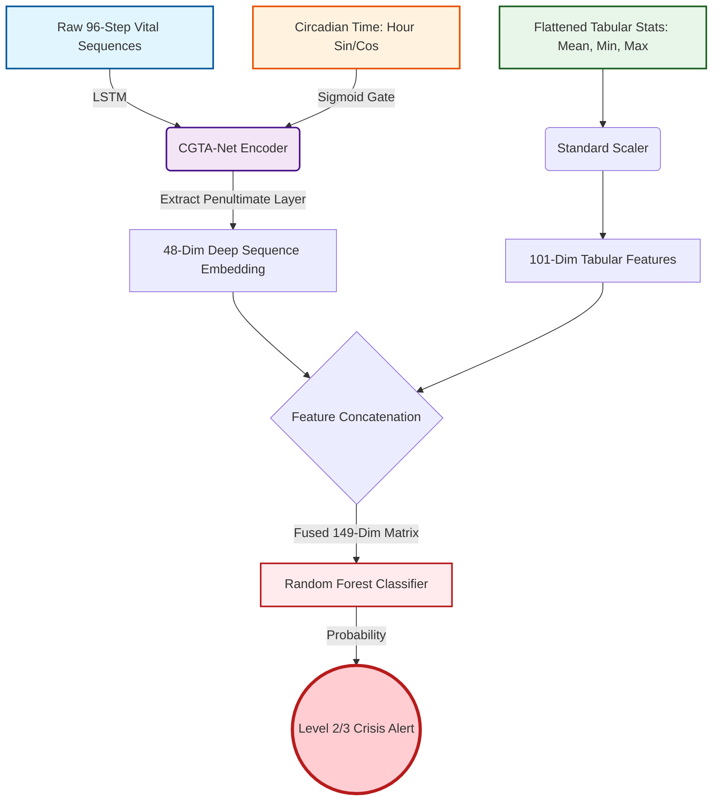

```mermaid
graph TD
    %% Data Inputs
    A[Raw 96-Step Vital Sequences] -->|LSTM| C(CGTA-Net Encoder)
    B[Circadian Time: Hour Sin/Cos] -->|Sigmoid Gate| C

    %% Tabular Branch
    D[Flattened Tabular Stats: Mean, Min, Max] --> E(Standard Scaler)

    %% Deep Extraction
    C -->|Extract Penultimate Layer| F[48-Dim Deep Sequence Embedding]
    E --> G[101-Dim Tabular Features]

    %% Fusion & Classification
    F --> H{Feature Concatenation}
    G --> H

    H -->|Fused 149-Dim Matrix| I[Random Forest Classifier]
    I -->|Probability| J((Level 2/3 Crisis Alert))

    %% Styling
    style A fill:#e1f5fe,stroke:#01579b,stroke-width:2px
    style B fill:#fff3e0,stroke:#e65100,stroke-width:2px
    style D fill:#e8f5e9,stroke:#1b5e20,stroke-width:2px
    style C fill:#f3e5f5,stroke:#4a148c,stroke-width:2px
    style I fill:#ffebee,stroke:#b71c1c,stroke-width:2px
    style J fill:#ffcdd2,stroke:#b71c1c,stroke-width:4px
```